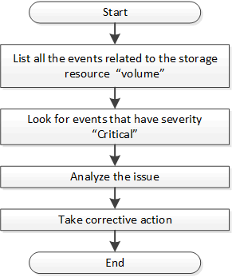

= Détermination des problèmes dans les objets de stockage à l'aide des API d'événements
:allow-uri-read: 
:icons: font
:imagesdir: ../media/

[role="lead"]
Lorsqu'un objet de stockage de votre data Center franchit un seuil, vous obtenez une notification à propos de cet événement. Grâce à cette notification, vous pouvez analyser le problème et appliquer les actions correctives nécessaires à l'aide des `events` API.

Ce flux de travail utilise l'exemple d'un volume en tant qu'objet de ressource. Vous pouvez utiliser les `events` API pour récupérer la liste des événements liés à un volume, analyser les problèmes critiques pour ce volume, puis prendre des mesures correctives pour corriger le problème.

Procédez comme suit afin de déterminer les problèmes rencontrés sur votre volume avant de prendre les mesures correctives qui s'imposent.

.Étapes
. Analysez les notifications d'événements Active IQ Unified Manager critiques pour les volumes de votre data Center.
. Interroger tous les événements pour les volumes à l'aide des paramètres suivants de l'API /management-Server/events :
`"*resource_type": "volume*"`
`"*severity": "critical*"`
+
[cols="3*"]
|===
| Catégorie | Verbe HTTP | Chemin 

 a| 
serveur-gestion
 a| 
OBTENEZ
 a| 
/serveur-gestion/événements

|===
. Affichez la sortie et analysez les problèmes des volumes spécifiques.
. Effectuez les actions nécessaires en utilisant l'API REST ou l'interface utilisateur Web de Unified Manager pour résoudre les problèmes.

